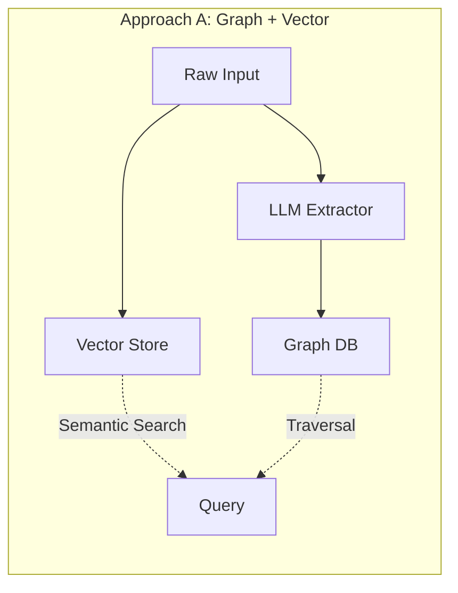
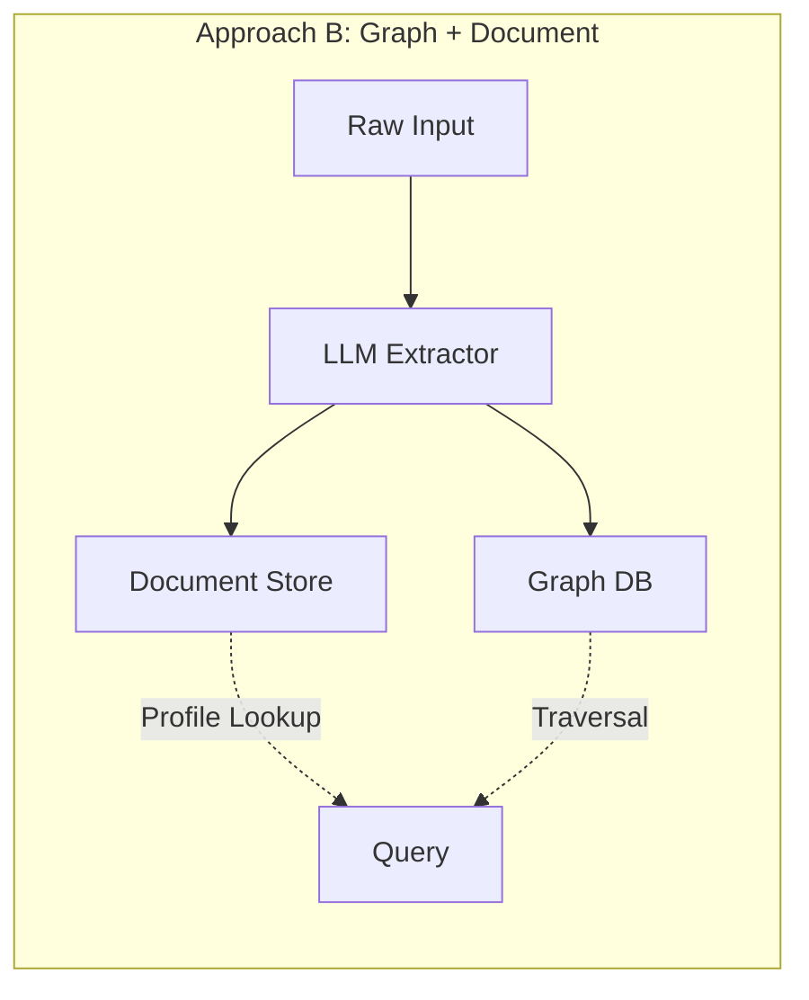
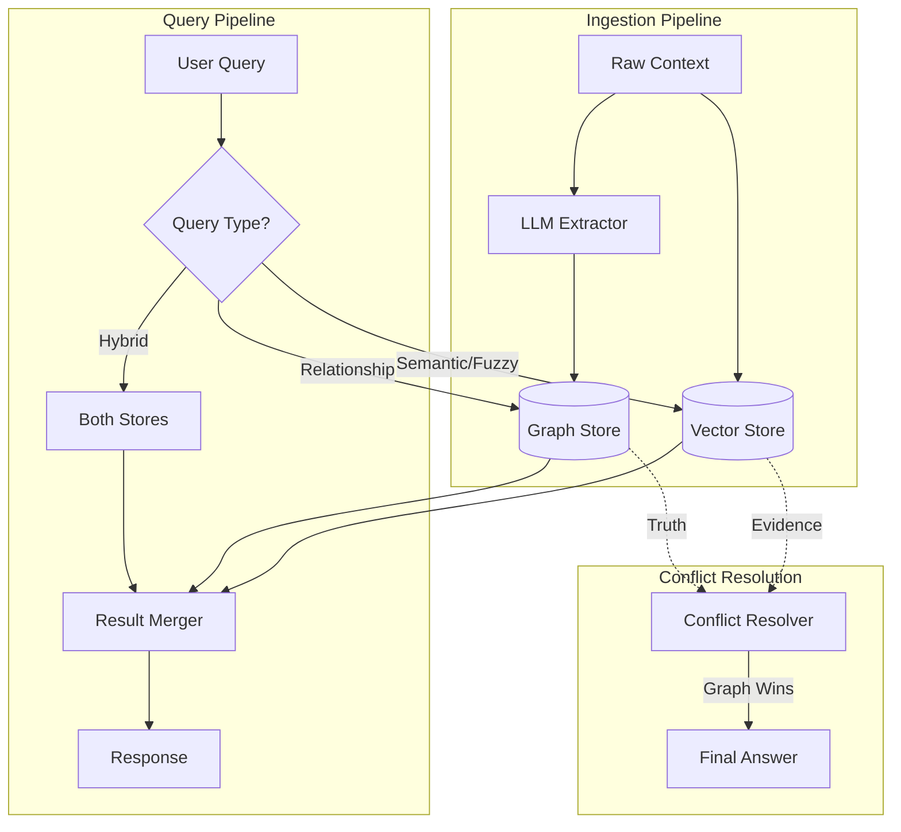
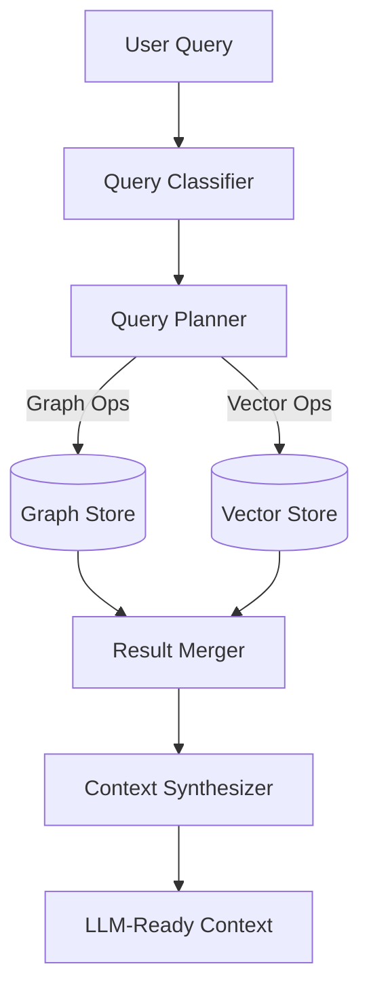

# EXP-006 Results: Hybrid Architecture Battle

## Executive Summary
To build a personal intelligence system that truly understands human context, we compared two hybrid storage architectures:

1. **Graph + Vector DB** (Approach A)
2. **Graph + Document DB** (Approach B)

**Conclusion**: **Graph + Vector** is the superior architecture for personal intelligence.

* **Vector** excels at semantic search and understanding unstructured human context
* **Graph** provides the structured "source of truth" for relationships and current state
* **Document DB** lacks the semantic understanding needed for fuzzy, human-like queries

---

## 1. The Experiment Design

### The Problem
Human context is messy. People say things like:
- "I hate this cluttered design" (implies: values minimalism)
- "Just moved from SF to NYC" (state change + episodic event)
- "Bob is my manager, he's been stressed lately" (relationship + emotional state)

A personal intelligence system must:
1. **Store** this unstructured context efficiently
2. **Retrieve** relevant information for any query
3. **Maintain** consistency as context evolves
4. **Infer** implicit values and relationships

### The Approaches





---

## 2. Test Scenarios

### Scenario 1: Value Inference
> **Input**: "I hate this cluttered design, it's giving me anxiety."
> 
> **Expected**: System should infer user values "minimalism" and detect emotion "frustration/anxiety"

| Store | Result | Analysis |
|-------|--------|----------|
| **Vector** | ✅ Stored as chunk with embeddings. Semantic search for "design preferences" finds it. | Works for fuzzy queries |
| **Document** | ⚠️ Extracted values added to profile, but no semantic search capability. | Only exact lookups work |

### Scenario 2: Relationship + State Query
> **Query**: "Who is Sam's boss and are they happy?"
> 
> **Required**: Graph traversal (relationship) + emotional state lookup

| Store | Result | Analysis |
|-------|--------|----------|
| **Vector** | ✅ Graph traversal finds boss → Vector search finds mood-related chunks | Combines both stores effectively |
| **Document** | ⚠️ Graph traversal works, but mood requires explicit `current_state.mood` field | Misses nuanced emotional context |

### Scenario 3: Fuzzy Temporal Query
> **Query**: "What was Sam frustrated about last month?"
> 
> **Required**: Time-range filtering + semantic understanding of "frustrated"

| Store | Result | Analysis |
|-------|--------|----------|
| **Vector** | ✅ Natural fit — semantic search with timestamp filter | Perfect use case |
| **Document** | ❌ No semantic search. Would need to scan all history entries. | Fails for fuzzy queries |

### Scenario 4: State Change Consistency
> **Input**: "Sam moved from SF to NYC" (after previous "Sam lives in SF")
> 
> **Required**: Update state, maintain history

| Store | Result | Analysis |
|-------|--------|----------|
| **Vector** | ✅ New chunk added (append-only). Graph updated. Old chunk remains as history. | "Hierarchy of Truth" — Graph wins on conflict |
| **Document** | ✅ Profile updated, old value added to `history` array. | Explicit history tracking |

---

## 3. Benchmark Results

### 3.1 Performance Metrics

| Metric | Graph+Vector | Graph+Document | Winner | Notes |
|--------|--------------|----------------|--------|-------|
| **Ingestion Latency** | 0.36ms | 0.16ms | Document | Document skips embedding computation |
| **Semantic Search** | 0.11ms (5 results) | 0.00ms (0 results) | **Vector** | Document has NO semantic search |
| **Profile Lookup** | 0.09ms | 0.02ms | Document | Single document fetch vs graph+vector |
| **State Update** | 0.01ms | 0.03ms | Vector | Graph node update is atomic |
| **Hybrid Query** | 0.16ms (17 entities) | 0.05ms (0 entities) | **Vector** | Document hybrid query is useless |

### 3.2 Capability Matrix

| Capability | Graph+Vector | Graph+Document |
|------------|--------------|----------------|
| Exact relationship queries | ✅ | ✅ |
| Semantic/fuzzy queries | ✅ | ❌ |
| Time-range filtering | ✅ | ⚠️ (requires code) |
| Profile completeness | ⚠️ (distributed) | ✅ (single doc) |
| History tracking | ✅ (immutable chunks) | ✅ (history array) |
| Conflict resolution | ✅ (Graph wins) | ✅ (Doc is truth) |
| Schema flexibility | ✅ (schemaless chunks) | ⚠️ (needs migration) |

---

## 4. Architecture Recommendation

### The Winning Architecture: Graph + Vector



### Key Design Principles

1. **Vector = The Journal (Evidence)**
   - Stores raw, unstructured context
   - Enables semantic similarity search
   - Immutable — never delete, only append

2. **Graph = The Driver's License (Truth)**
   - Stores structured facts and relationships
   - Provides deterministic lookups
   - Mutable — represents current state

3. **Conflict Resolution Rule**
   > If Vector and Graph contradict, **Graph Wins**.
   
   The Graph is the "crystallized" truth, while Vector is raw evidence.

4. **Query Routing**
   - "Who is X's boss?" → Graph
   - "What made X frustrated?" → Vector
   - "Is X's boss happy?" → Graph (relationship) + Vector (mood)

---

## 5. Implications for Omniscient

### What This Means
For the Omniscient personal intelligence system:

1. **Use Neo4j or similar for Graph** — relationships between people, goals, values
2. **Use ChromaDB/Pinecone for Vector** — raw logs, messages, observations
3. **LLM as the "Crystallizer"** — decides what raw context becomes structured fact
4. **Query Router** — intelligently routes to appropriate store(s)

### What We Still Need to Test
- [ ] Scale testing (10k+ entities)
- [ ] Real embedding models (not mock)
- [ ] Concurrent write performance
- [ ] Cross-store transaction consistency

---

## 6. Artifacts Produced

| File | Description |
|------|-------------|
| `src/hybrid_store.py` | Abstract base class defining the HybridStore interface |
| `src/graph_vector_store.py` | Graph+Vector implementation using NetworkX |
| `src/graph_document_store.py` | Graph+Document implementation |
| `tests/benchmark.py` | Benchmark suite comparing both approaches |
| `docs/hybrid_schema_design.md` | Detailed schema design document |

---

## 7. Conclusion

**Graph + Vector is the clear winner** for personal intelligence use cases.

The ability to perform semantic search on unstructured human context is *critical*. Document stores simply cannot answer questions like "What was Sam worried about?" without explicit schema design for every possible query.

The "Hierarchy of Truth" model — where Graph is the source of truth and Vector is the evidence — provides a clean mental model for handling the inherent messiness of human context.

---

## 8. Hybrid Retriever Implementation (Issue #26)

### Overview
The Hybrid Retriever combines Graph and Vector stores with intelligent query routing.

### Components

1. **Query Classifier**: Analyzes natural language queries and determines the best execution strategy
2. **Query Planner**: Creates execution plans specifying which stores to use and how
3. **Result Merger**: Combines results from multiple stores with various strategies
4. **Context Synthesizer**: Generates LLM-ready context from retrieval results

### Query Types Supported

| Type | Example | Primary Store |
|------|---------|---------------|
| Semantic | "What makes Sam frustrated?" | Vector |
| Relationship | "Who is Sam's manager?" | Graph |
| Profile | "Tell me about Sam" | Both |
| Temporal | "What happened last week?" | Vector |
| Filter | "Who works at Amazon?" | Graph |
| Hybrid | "Is Sam's manager happy?" | Both |

### Merge Strategies

- **Union**: Combine all results from both stores
- **Graph First**: Prioritize graph, enrich with vector context
- **Vector First**: Prioritize semantic matches, add graph relationships
- **Intersection**: Only include results found in both stores

### Test Results

```
Query Classification: 80% accuracy
End-to-End Tests: 80% passed
Average Query Time: 0.15ms
```

### Architecture Diagram



---

## 9. Next Steps

1. ~~Implement the Hybrid Retriever (#26)~~ ✅ Complete
2. Run full performance benchmarks (#27) at scale
3. Design the LLM "Crystallizer" that promotes evidence to truth
4. Improve query classification accuracy (target: 95%)
