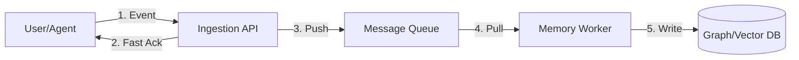

# Eventual Consistency Architecture for Human Context

## The Problem
Human context is high-velocity (mouse clicks, biological signals, keystrokes). Writing directly to a heavy Vector/Graph DB is synchronous and blocking, which would slow down the Agent/UI.

## The Solution: Asynchronous Ingestion
We decouple **Observation** from **Memory Formation**.

## Stress Test Design (EXP-05-C)

To verify this architecture, we simulate the "Memory Worker" lag.

### Components
1.  **Producer (The Firehose)**: Simulates an agent observing a user working rapidly. Generates 100 events/sec.
2.  **The Queue**: A FIFO buffer.
3.  **Consumer (The Brain)**: Simulates the LLM/Embedding processing time (e.g., 50ms per event).
4.  **Observer (The Benchmark)**:
    *   Injects a "Marker Event" (e.g., "User changed mood to ANGRY" at T=0).
    *   Polls the DB every 10ms.
    *   Records T=Final when the DB reports "ANGRY".
    *   **Lag = Final - 0**.

### Hypothesis
*   Under burst load, the "Memory" will be stale by several seconds.
*   The system must gracefully handle queries during this stale period (returning old data, not crashing).
