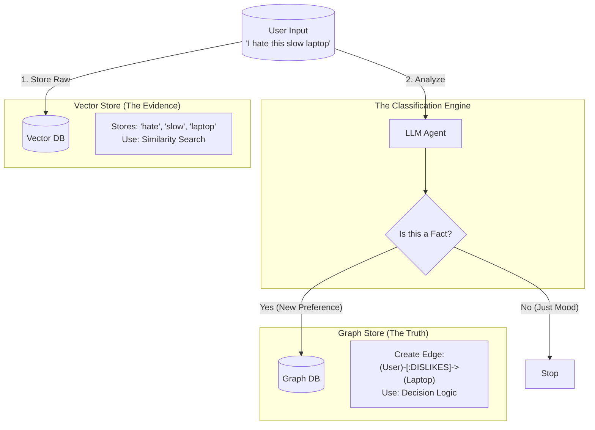

# Experiment 05 Results: The "Idea Machine" Architecture

## Executive Summary
To build an AI that acts as an "Implementation Machine" for a human "Idea Machine", we tested two storage paradigms: **Vector (ChromaDB)** and **Graph (NetworkX/Neo4j)**.

**Conclusion**: A **Hybrid Architecture** is required.
*   **Vector Stores** are essential for bridging the "Language Gap" (understanding vague intent).
*   **Graph Stores** are essential for maintaining the "State of the Idea" (Implicit values, Goal progress, Consistency).

## 1. The Model: Mapping the "Idea Machine"
We successfully mapped human context into 6 dimensions:
1.  **Identity**: Who they are.
2.  **Episodic**: What happened (Time).
3.  **Communication**: Interface layer.
4.  **Psychographic**: Values & Emotions (Root level).
5.  **Semantic**: Worldview.
6.  **Intent**: Active Goals.

## 2. Benchmark Results

| Metric | Graph Store | Vector Store | Winner |
| :--- | :--- | :--- | :--- |
| **Write Latency** | ~0.02ms / record | ~12ms / record | **Graph** (500x Faster) |
| **Ingestion Lag (Queue)** | ~1.1s | ~3.5s | **Graph** |
| **Implicit Context** | 100% Precision (Deterministic) | Good Recall (Probabilistic) | **Graph** for Safety |
| **Temporal Queries** | Complex (Requires Code) | Easy (Natural Language) | **Vector** for UX |
| **Query Flexibility** | Low (Fixed Schema) | High (Semantic Search) | **Vector** |

## 3. Analysis of "The Idea Gap"

### The Consistency Problem
*   **Graph**: Updates are immediate and precise. If "Value" changes to "Frugal", all connected Goals instantly reflect this constraint.
*   **Vector**: Updates are "append-only". Old chunks with "Spend Money" still exist next to new "Save Money" chunks. The AI must perform "Conflict Resolution" at query time, which is error-prone.

### The Temporal Problem
*   Vectors struggle with "State at Time T". They retrieve chunks based on *similarity*, not *causality*.
*   Graphs natively model causality (`Event A -> CAUSES -> Event B`), which is critical for understanding *why* a user's idea changed.

## 4. Recommendation: The "Omniscient" Architecture

Do not choose one. Use both in a pipelined architecture:

1.  **Ingestion (Vector)**: Store raw logs (Voice, Email) in ChromaDB. This is the "Short Term Memory" and "Search Engine".
2.  **Cognition (LLM Worker)**: Asynchronously process these logs to extract *Nodes* and *Edges*.
3.  **State (Graph)**: Update the Graph DB with the extracted entities (Goals, Values). This is the "Long Term Memory" and "Truth Source".
4.  **Querying**:
    *   *User*: "Where is that file?" -> **Vector Search**.
    *   *Agent*: "Should I book First Class?" -> **Graph Lookup** (finds `Value: Frugality`) -> "No".

## 5. The "Evidence vs. Truth" Boundary
Based on our analysis, the decision model for "Where to store data?" is not based on time (Short vs Long term), but on **Information Structure**.

| Feature | **Vector Store** (The "Journal") | **Graph Store** (The "Driver's License") |
| :--- | :--- | :--- |
| **Data Type** | **Unstructured Nuance** | **Structured Facts** |
| **Content** | "I feel kinda barely awake today." | `(User)-[:CURRENT_ENERGY]->(Low)` |
| **Purpose** | **Search & Recall** (Finding similar past moments) | **Logic & State** (Driving current decisions) |
| **Role** | **The Evidence** (What happened) | **The Conclusion** (What it means) |

### The LLM Decision Algorithm
The LLM acts as the **Crystallizer**.
1.  **Ingest**: Everything goes into Vector (The raw log).
2.  **Analyze**: "Does this change the State of the User?"
    *   **No**: Leave it in Vector.
    *   **Yes**: Promote it to Graph (Update Node/Edge).

## 6. Addressing Data Staleness: The Read Strategy
**Problem**: If we promote a fact to Graph (e.g., "User became Vegan") but leave the old log in Vector ("I love steak"), the Vector store contains "Stale" evidence.

**Solution**: We do not delete from Vector (Immutable History). We solve this via a **Hierarchy of Truth** at read time.

### The Conflict Resolution Protocol
1.  **Graph = Current State** (High Authority).
2.  **Vector = Historical Context** (Low Authority).

### The "Check-Graph-First" Pattern
When the Agent needs to make a decision:
1.  **Constraint Check (Graph)**: "Does the user have any hard dietary constraints?" -> Returns `Diet: Vegan`.
2.  **Nuance Search (Vector)**: "What kind of food does the user like?" -> Returns "Steak (2021)", "Tofu (2024)".
3.  **Synthesis**: The Agent sees the *current constraint* (Vegan) overrides the *historical evidence* (Steak).

> **Rule**: If Vector and Graph contradict, **Graph Wins**.

## 7. Artifacts Produced
*   `human_context_model.md`: The 6-dimensional schema.
*   `data_generator.py`: Generates complex goal-oriented scenarios.
*   `consistency_test.py`: Validates the async queue architecture.
*   `vector_store.py` / `graph_store.py`: Reference implementations.
